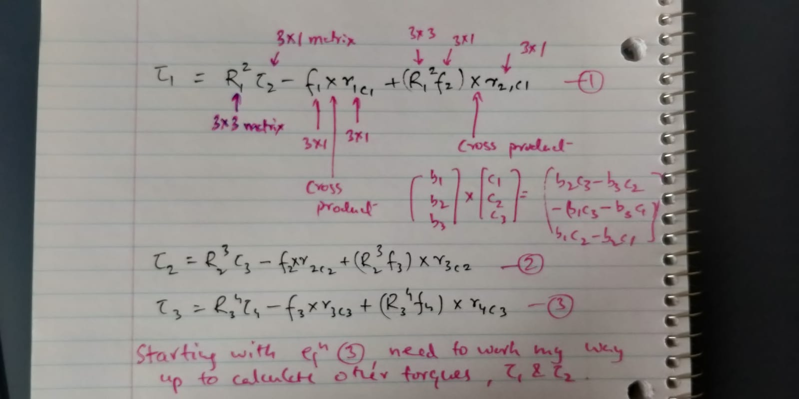

<h2 align="center">

 Attempting to help my friends

</h2>

<p align="center">

</p>

<h3 align="center">
A repo for some of the problems my friends faced because friends in need are friends indeed, XD.
</h3>

<br>

### Problem 1
Some torque equation to be expressed in python - The equations are to be calculated in a recursive way for WAM Robotic Arm



**Steps to run**

```python
pip install -r requirements.txt
python sol1.py
```

<br>
<br>

### Problem 2
Proof of concept that load balancers are good at defending against DoS attacks 

| PORT | What is deployed | Replicas | 
|:----:|:----------------:|:--------:|
| 5000 | The voting applicatioon | 4 | 
| 5001 | The results | 1 |
| 3000 | A simple HTTP server | 1 |

* SSH into the VM

```bash
ssh root@139.59.23.158 
# Ask the password from the admin
```

* Create a simple python server
```
python -m SimpleHTTPServer 3000
```

* DoS the server
```
nuke 3000
```

* Go to `139.59.23.158:3000` to see that it has been DoSsed. Now `Ctrl` + `C` to exit nuke mode and reload. DoS ends

* DoS the voting app 
```
nuke 5000
```

* Go to `139.59.23.158:5000` and wait for a few seconds. The app works!!

**Inference**

Due to 4 replicas sharing load, it is very difficult to fully DoS the voting app. But our simple HTTP server could not handle the load and hence got DoSsed.

<br>
<br>

Made with :heart: and :octocat: for my friends

